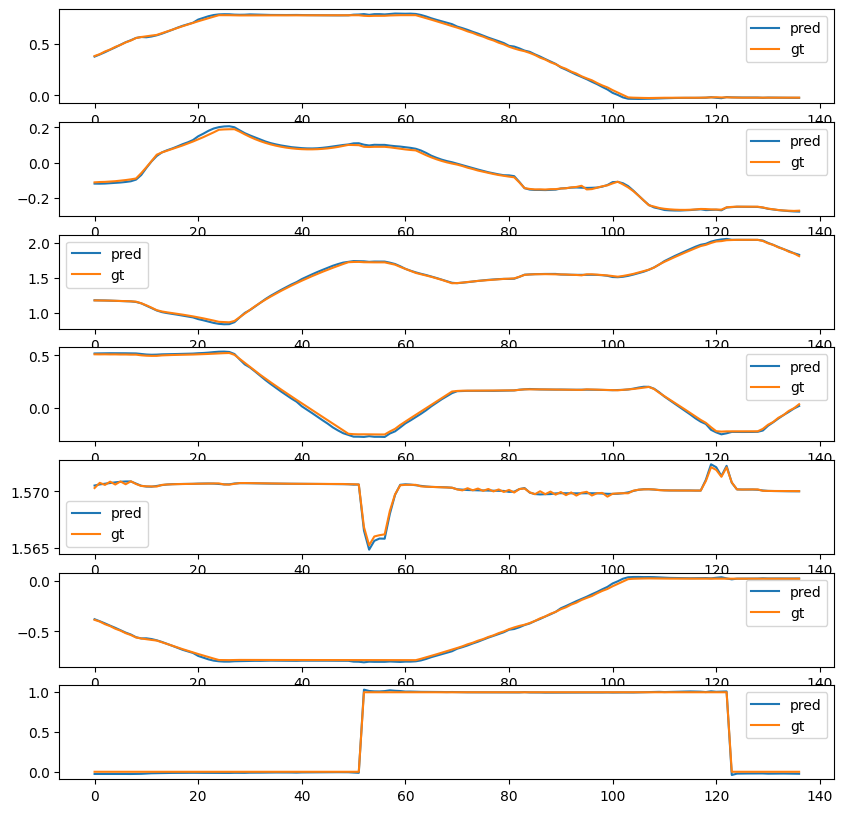
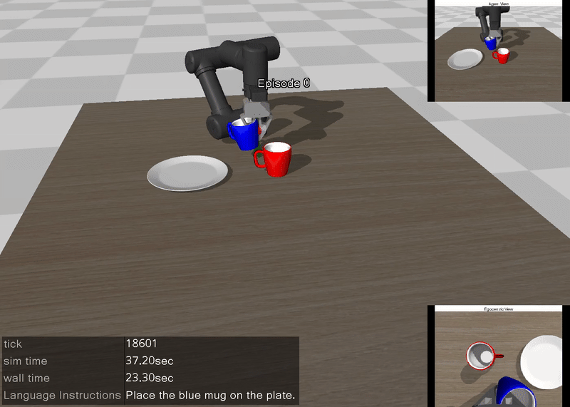
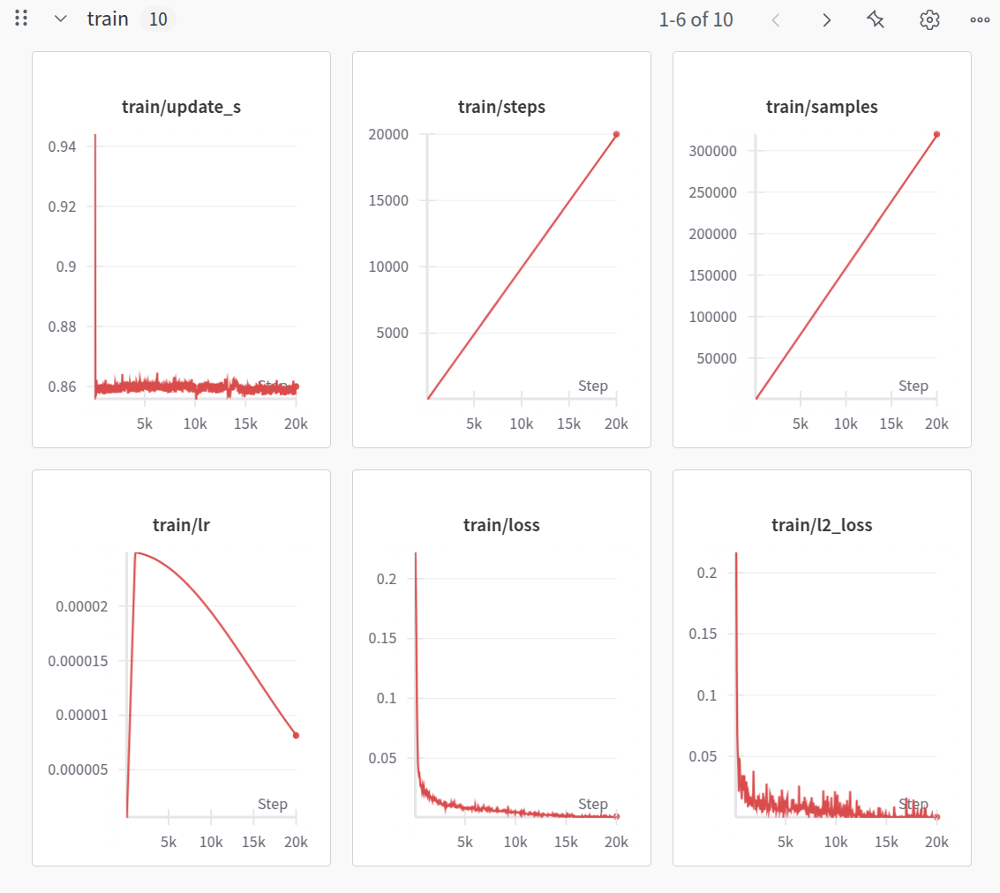
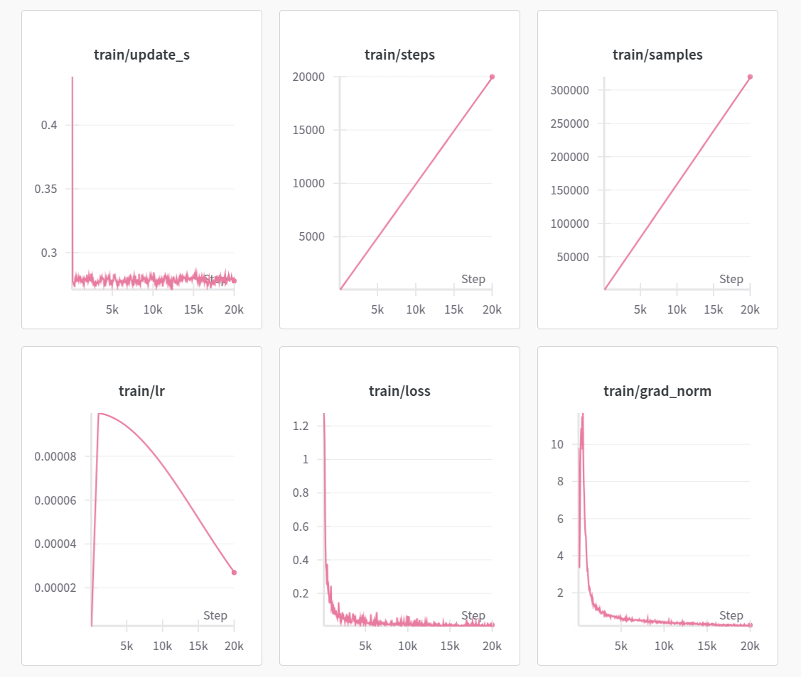

# LeRobot + MuJoCo 机械臂操作教程：代码说明文档

本文档面向想在自定义仿真环境中**采集示教数据、训练并部署视觉-语言-动作（VLA）/模仿学习策略**的读者，对本仓库的代码结构、运行流程、关键模块以及背后的模型原理做系统讲解。

整个项目围绕一条主线展开：

> 在 MuJoCo 里搭一个桌面抓放（pick-and-place）场景 → 用键盘遥操作机械臂采集示教数据，存成 LeRobot 数据集 → 训练动作策略（ACT / π0 / SmolVLA）→ 把训练好的策略放回仿真里自动执行并评估。

机器人为 ROBOTIS 公司的 6 自由度机械臂 **OMY** 加一个平行夹爪，任务是"把杯子放到盘子上"。


---

## 目录

1. [整体架构与目录结构](#一整体架构与目录结构)
2. [环境安装](#二环境安装)
3. [核心概念与数据流](#三核心概念与数据流)
4. [底层代码模块详解（mujoco_env）](#四底层代码模块详解mujoco_env)
5. [完整工作流程与运行步骤](#五完整工作流程与运行步骤)
6. [模型原理详解](#六模型原理详解)
7. [配置文件说明](#七配置文件说明)
8. [常见问题（FAQ）](#八常见问题faq)
9. [致谢与参考](#九致谢与参考)

---

## 一、整体架构与目录结构

项目分为三层：**仿真底层（mujoco_env）** → **任务环境封装（SimpleEnv / SimpleEnv2）** → **教程脚本（按用途命名的 .py 脚本 + 训练脚本）**。

```
lerobot-mujoco-tutorial-master/
├── mujoco_env/                 # 仿真底层与环境封装（核心 Python 代码）
│   ├── mujoco_parser.py        # MuJoCo 解析器/仿真封装（约 4400 行，本项目地基）
│   ├── utils.py                # 通用工具：随机采样、图像处理、轨迹插值、XML 等
│   ├── ik.py                   # 逆运动学（IK）求解：增广雅可比 + 阻尼最小二乘
│   ├── transforms.py           # 坐标/旋转变换：欧拉角、四元数、齐次矩阵、点云等
│   ├── SimpleEnv1.py           # 单物体抓放环境 SimpleEnv1
│   └── SimpleEnv2.py           # 语言条件多物体环境 SimpleEnv2
│
├── act/                        # 【流水线一】ACT 模仿学习全流程
│   ├── collect_data_act.py     #   步骤1：键盘遥操作采集示教数据
│   ├── visualize_data_act.py   #   步骤2：回放/可视化已采集数据
│   ├── train_act.py            #   步骤3：训练 ACT 模型
│   └── deploy_act.py           #   步骤4：在仿真中部署 ACT 策略
│
├── vla/                        # 【流水线二】语言条件 VLA（π0 / SmolVLA）全流程
│   ├── collect_data_language.py    #   步骤5：采集带语言指令的数据
│   ├── visualize_data_language.py  #   步骤6：可视化语言条件数据
│   ├── train_vla.py            #   训练 π0 / SmolVLA 的通用入口
│   ├── deploy_pi0.py           #   步骤7：部署微调好的 π0
│   └── deploy_smolvla.py       #   步骤8：部署微调好的 SmolVLA
│
├── config/                     # 训练配置文件
│   ├── pi0_omy.yaml            #   π0 训练配置
│   └── smolvla_omy.yaml        #   SmolVLA 训练配置
├── requirements.txt            # 依赖清单
│
├── asset/                      # 仿真资源
│   ├── robotis_omy/            # OMY 机械臂的 MJCF 模型与网格
│   ├── tabletop/               # 桌面、相机、各类可抓取物体
│   ├── objaverse/              # 杯子/盘子网格（plate_11 需解压）
│   ├── example_scene_y.xml     # 单物体场景（SimpleEnv 使用）
│   └── example_scene_y2.xml    # 语言条件多物体场景（SimpleEnv2 使用）
│
└── media/                      # 本文档用到的演示图/动图

# 运行后会自动生成（已在 .gitignore 中忽略，不在仓库里）：
#   demo_data/            ACT 流水线采集的数据集
#   demo_data_language/   VLA 流水线采集的语言条件数据集
#   ckpt/                 训练得到的模型检查点
```

**两条流水线（两个文件夹）：**

- **`act/`**：最简单的入门路线，训练并部署 **ACT** 模型（不需要语言指令，单相机即可）。按 `collect_data_act → visualize_data_act → train_act → deploy_act` 顺序走一遍即可跑通。
- **`vla/`**：进阶路线，采集带自然语言指令的数据，训练并部署 **π0 / SmolVLA** 这类视觉-语言-动作（VLA）模型（能听懂"把红色杯子放到盘子上"）。顺序为 `collect_data_language → visualize_data_language → train_vla → deploy_pi0 / deploy_smolvla`。

> **运行约定**：所有脚本统一**在项目根目录**下用 `python 文件夹/脚本名.py` 的方式运行（例如 `python act/train_act.py`）。每个脚本顶部都加了一小段"环境自举"代码：它会自动把项目根目录加入模块搜索路径、并把工作目录切到根目录，因此即使你 `cd` 进子文件夹再运行，`import mujoco_env` 和 `./asset`、`./demo_data`、`./ckpt` 等路径也都能正确找到。

**依赖关系一览：**

```
教程脚本 (各步骤 .py 脚本 / train_act.py / train_vla.py)
        │  调用
        ▼
SimpleEnv1 / SimpleEnv2  (SimpleEnv1.py / SimpleEnv2.py)   ← 任务级封装：reset / step / teleop / 成功判定
        │  组合
        ▼
MuJoCoParserClass (mujoco_parser.py)             ← 仿真级封装：加载模型 / 步进 / 渲染 / 相机
        │  依赖
        ▼
ik.py（逆运动学） + transforms.py（坐标变换） + utils.py（工具）
        │  底层
        ▼
MuJoCo 3.1.6 物理引擎
```

---

## 二、环境安装

本章手把手带你从零搭好运行环境。**第一次跑这类项目的同学，照着从头做到尾即可。**

> **环境前提**
> - 操作系统：Linux（推荐 Ubuntu 20.04/22.04）或 Windows 均可；**遥操作采集**需要带显示器的机器。
> - Python：**3.10**（必须，其他版本可能装不上指定依赖）。
> - MuJoCo：**3.1.6**（由 `requirements.txt` 锁定，无需单独装）。
> - GPU：**训练 ACT / π0 / SmolVLA 需要 NVIDIA 显卡**（依赖按 CUDA 12.4 的 PyTorch 2.6 配置）；只想"回放数据/看仿真"则用 CPU 也能跑。

### 0. 准备工作：装 Conda 与 Git

如果你电脑里还没有 Conda 和 Git，先装好它们（已装过可跳过）：

- **Conda**：去 [Miniconda 官网](https://docs.conda.io/en/latest/miniconda.html) 下载对应系统的安装包装上。它用来创建互不干扰的"虚拟环境"。
- **Git**：去 [git-scm.com](https://git-scm.com/downloads) 下载安装。它用来下载本项目和 LeRobot 代码。

装完后，打开终端（Windows 用"Anaconda Prompt"，Linux 用普通终端），输入下面两行能看到版本号就说明装好了：

```bash
conda --version
git --version
```

### 1. 下载本项目代码

```bash
# 把项目克隆到本地（或直接下载 zip 解压亦可）
git clone <本项目仓库地址> lerobot_mujoco
cd lerobot_mujoco
```

> 之后所有命令，默认你**都在这个项目根目录 `lerobot_mujoco/` 下执行**。

### 2. 创建并激活虚拟环境

```bash
conda create -n lerobot python=3.10 -y   # 新建一个名为 lerobot 的环境
conda activate lerobot                   # 激活它（之后每次开新终端都要先执行这句）
```

> 激活成功后，命令行最前面会出现 `(lerobot)` 字样。**之后跑任何脚本前，都要先确认 `(lerobot)` 已激活。**

### 3. 安装所有依赖（含 LeRobot）

本项目的核心库 **LeRobot 不要用 `pip install lerobot` 直接装**（官方源版本变动快、容易和本项目其他依赖冲突）。我们已经在 `requirements.txt` 里**锁定了一个经过验证、可用的 LeRobot 指定提交（commit）**，连同 PyTorch、MuJoCo 等一并安装，一条命令搞定：

```bash
pip install -r requirements.txt
```

这条命令会做这些事（无需手动操作，了解即可）：

| 依赖 | 版本 | 用途 |
|------|------|------|
| `mujoco` | 3.1.6 | 物理仿真引擎 |
| `torch / torchvision / torchaudio` | 2.6.0（cu124） | 深度学习框架（CUDA 12.4） |
| `transformers` | 4.50.3 | π0/SmolVLA 的视觉语言骨干 |
| `lerobot` | 锁定的 git commit | 数据集格式、策略实现、训练工具 |
| `datasets` | 3.4.1 | 数据集底层 |
| `pyautogui / matplotlib / scipy` | — | 遥操作、绘图、数值工具 |

> **关于 LeRobot 是怎么装进来的**：`requirements.txt` 最后一行
> `git+https://github.com/huggingface/lerobot.git@10b7b35...#egg=lerobot`
> 表示 pip 会自动从 GitHub 克隆 LeRobot 仓库、切到那个指定 commit 再安装。**因此安装时需要联网，并且能正常访问 GitHub。** 如果这一步卡住或失败，多半是网络问题，见 [FAQ Q7](#八常见问题faq)。

**验证安装是否成功**（无报错即 OK）：

```bash
python -c "import mujoco, torch, lerobot; print('mujoco', mujoco.__version__); print('cuda ok:', torch.cuda.is_available())"
```

- 能打印出 `mujoco 3.1.6` 说明仿真库就绪。
- `cuda ok: True` 说明显卡可用（可训练）；若是 `False`，仿真/回放仍能跑，但训练会很慢或失败，请检查显卡驱动与 CUDA。

### 4. 解压物体资源（必做）

杯子/盘子的网格模型以压缩包形式提供，**必须先解压**，否则加载场景时会报找不到 `plate_11` 的错误：

```bash
cd asset/objaverse
unzip plate_11.zip      # Windows 无 unzip 命令时，直接用资源管理器右键“解压到当前文件夹”
cd ../..                # 回到项目根目录
```

解压后 `asset/objaverse/` 下应能看到 `plate_11/` 文件夹。

### 5. 关于"无显示器"的服务器

- **需要图形界面（有显示器/桌面）的脚本**：所有遥操作采集（`collect_data_act.py`、`collect_data_language.py`）和带窗口回放/部署的脚本（`visualize_*`、`deploy_*`），它们会弹出 MuJoCo 窗口并读键盘。
- **纯命令行服务器即可**：训练脚本（`train_act.py`、`train_vla.py`）。

> 如果只有一台无显示器的 GPU 服务器，可以在本地有屏幕的机器上采集数据，把数据拷到服务器训练；或直接使用第三章/第六章提到的 **Hugging Face 现成数据集**，跳过采集直接训练。

---

## 三、核心概念与数据流

### 1. 任务定义

- **场景**：桌面上有一个/多个杯子和一个盘子。
- **目标**：把杯子抓起来放到盘子上。
- **成功判定**（见 `SimpleEnv1.py::check_success`）：杯子与盘子水平距离 < 0.1 m、竖直距离 < 0.6 m、夹爪张开，且末端执行器抬升到高度 0.9 m 以上。三者同时满足才算成功。

### 2. 数据集格式（LeRobot Dataset）

采集到的数据以 **LeRobotDataset v2.1** 格式保存，`parquet` 存逐帧数据，`meta/` 存元信息。每一帧包含以下字段（`fps=20`，`robot_type="omy"`）：

| 字段 | 类型 | 形状 | 含义 |
|------|------|------|------|
| `observation.image` | image | (256, 256, 3) | 智能体视角（agentview）相机图 |
| `observation.wrist_image` | image | (256, 256, 3) | 腕部（第一人称 egocentric）相机图 |
| `observation.state` | float32 | (6,) | 末端执行器位姿 `[x, y, z, roll, pitch, yaw]` |
| `action` | float32 | (7,) | 6 个关节角 + 1 个夹爪开合 |
| `obj_init` | float32 | (6,) | 物体初始位姿（仅记录，不参与训练） |

> 语言条件数据集（步骤 5/6）在此基础上，每帧还通过 `task` 字段写入一条自然语言指令，例如 `"Place the red mug on the plate."`，用于训练能听懂指令的 VLA 策略。

数据集目录结构：

```
demo_data/
├── data/
│   └── chunk-000/
│       ├── episode_000000.parquet
│       └── ...
└── meta/
    ├── episodes.jsonl     # 每条回合的索引/长度/任务
    ├── episodes_stats.jsonl
    ├── info.json          # 全局信息：fps、特征定义、总帧数等
    ├── stats.json         # 各特征的均值/方差（用于归一化）
    └── tasks.jsonl        # 任务（语言指令）列表
```

如果你不想自己采集，Hugging Face 上有现成的语言条件数据集 [`Jeongeun/omy_pnp_language`](https://huggingface.co/datasets/Jeongeun/omy_pnp_language)，可直接下载用于熟悉数据格式或训练（下载方式见[步骤 2](#步骤-2回放与可视化数据visualize_data_actpy) 与[步骤 6](#步骤-6可视化语言条件数据visualize_data_languagepy)）。

### 3. 动作空间与状态空间

环境封装支持多种动作/状态表示，由构造参数 `action_type` / `state_type` 控制：

- **`action_type`**：
  - `eef_pose`：动作是末端位姿的增量 `[dx,dy,dz,droll,dpitch,dyaw, gripper]`，内部用 IK 解算出关节角（**遥操作采集时使用**）。
  - `joint_angle`：动作直接是 6 个目标关节角 + 夹爪。
  - `delta_joint_angle`：动作是关节角增量 + 夹爪。
- **`state_type`**：`joint_angle`（关节角）、`ee_pose`（末端位姿）或 `delta_q`（关节角增量）。

> 采集时人通过键盘控制"末端往哪个方向移动一点"（`eef_pose` 增量），但**存进数据集 / 喂给策略学习的 `action` 是 7 维的"6 关节角 + 夹爪"**——也就是 IK 解算后的关节空间指令。这样策略学到的是直接可执行的关节目标。

---

## 四、底层代码模块详解（mujoco_env）

### 4.1 `mujoco_parser.py` —— 仿真封装地基

整个项目的"地基"，核心是 **`MuJoCoParserClass`** 类（改编自 [yet-another-mujoco-tutorial](https://github.com/sjchoi86/yet-another-mujoco-tutorial-v3)），另含两个辅助类 `MinimalCallbacks` 与 `MuJoCoMinimalViewer`（负责底层 GLFW 窗口、鼠标/键盘回调与渲染）。它把"用 MuJoCo 写仿真"所需的零碎操作封装成一套统一接口：

- **模型加载与信息**：`_parse_xml`（解析刚体/关节/几何体/执行器/相机/传感器并建立名称→索引映射）、`print_info`、`print_body_joint_info`。
- **前向仿真与状态**：`reset`、`step`（施加控制并调用 `mj_step` 推进物理）、`forward`（正运动学，只更新姿态不推进时间）、`get_state`/`set_state`/`store_state`/`restore_state`、`solve_inverse_dynamics`（逆动力学）。
- **位姿读写**：`get_/set_p/R/T_body`（刚体位置/旋转/齐次变换）、`base_body`、`mocap`、`joint`、`geom`、`site`、`sensor`、`cam` 等系列。
- **相机与渲染**：`init_viewer`/`set_viewer`、`grab_rgbd_img`、`get_egocentric_rgb(d_pcd)`（腕部相机）、`get_fixed_cam_rgb(d_pcd)`（固定相机，如 agentview/sideview/topview）、深度图转点云。
- **可视化绘制**：`plot_T`/`plot_sphere`/`plot_box`/`plot_cylinder`/`plot_arrow`/`plot_traj`/`plot_contact_info`，以及文本与 RGB 图叠加层（用于在窗口角落显示多视角画面）。
- **IK 基础量**：`get_J_body`/`get_J_geom`（雅可比矩阵）、`get_ik_ingredients`（位姿误差向量）、`damped_ls`（阻尼最小二乘求关节增量 `dq`）。
- **键盘/鼠标交互**：`check_key_pressed`、`is_key_pressed_once/repeat`、左右键双击拾取 3D 坐标、`compensate_gravity`（重力补偿）等。

### 4.2 `ik.py` —— 逆运动学求解

实现"给定末端目标位姿，反解机械臂关节角"的功能，方法是**增广雅可比 + 阻尼最小二乘**迭代：

- `init_ik_info` / `add_ik_info`：构建并登记 IK 目标（目标刚体/几何体的目标位置 `p_trgt` 与目标旋转 `R_trgt`）。
- `get_dq_from_ik_info`：把所有目标的雅可比与位姿误差堆叠成增广方程，按指定关节列筛选后调用阻尼最小二乘求解关节增量 `dq`。
- `plot_ik_info`：在窗口中可视化当前位姿与目标位姿。
- `solve_ik`：**顶层入口**。迭代调用上述函数，每步对关节角做范围裁剪、正运动学更新，直到位姿误差收敛或达到最大迭代步数，返回求得的关节角。`SimpleEnv1.py` 的 `reset` 和 `eef_pose` 模式下的 `step` 都依赖它。

### 4.3 `transforms.py` —— 坐标与旋转变换工具

纯 NumPy 实现的一组刚体变换函数：

- 齐次变换分解：`t2pr`/`t2p`/`t2r`（4×4 变换矩阵 → 位置 p / 旋转 R）。
- 欧拉角 ↔ 旋转矩阵：`rpy2r`/`rpy2r_order`/`r2rpy`（滚转/俯仰/偏航）。
- 旋转矩阵 ↔ 四元数：`r2quat`/`quat2r`。
- 位姿 → 齐次矩阵：`pr2t`；旋转矩阵 → 角速度向量：`r2w`。
- 几何工具：`skew`（反对称矩阵）、`rodrigues`（罗德里格斯公式，轴角 → 旋转矩阵）、两点构造旋转、`align_z_axis`（z 轴对齐）。
- 视觉相关：`meters2xyz`（深度图 → 点云）、`R_yuzf2zuxf`/`T_yuzf2zuxf`（坐标系约定转换）。

### 4.4 `utils.py` —— 通用工具集

- **随机采样与场景布置**：`sample_xyzs`/`sample_xys`（采样若干互不重叠、满足最小间距的位置）、`ObjectSpawner`（在仿真中随机生成托盘与物体并赋予不碰撞位置）。
- **索引检索**：`get_idxs`/`get_idxs_contain`/`get_idxs_closest_ndarray`/`get_consecutive_subarrays`（按相等、子串、最近邻、连续段查索引）。
- **轨迹与运动学**：`finite_difference_matrix`、`get_A_vel_acc_jerk`、`get_interp_const_vel_traj_nd`（匀速插值轨迹）、`check_vel_acc_jerk_nd`（检查速度/加速度/加加速度）。
- **几何变换**：`compute_view_params`（由相机位姿算观察方位）、`unit_vector`、`rotation_matrix`（绕任意轴的 4×4 旋转矩阵）。
- **图像与可视化**：`get_colors`、`load_image`/`save_png`、`imshows`（多图并排）、`depth_to_gray_img`、`add_title_to_img`（给图加标题，遥操作叠加层用到）。
- **XML 与其他**：`get_xml_string_from_path`、`prettify`（美化 MuJoCo XML）、`TicTocClass`（计时器）、`get_monitor_size`、`sleep`。

### 4.5 `SimpleEnv1.py` —— 单物体抓放环境 `SimpleEnv`

把底层 `MuJoCoParserClass` 进一步封装成"任务级"环境，接口风格接近 Gym：

| 方法 | 职责 |
|------|------|
| `__init__(xml_path, action_type, state_type, seed)` | 加载场景 XML、建查看器、reset |
| `init_viewer` | 初始化可视化窗口（距离、仰角、叠加层等） |
| `reset(seed)` | 用 IK 把机械臂移到初始位姿，随机布置物体，预步进 100 次让物体稳定落下 |
| `step(action)` | 按 `action_type` 解算关节指令（`eef_pose` 走 IK）、组合夹爪指令，返回新状态 |
| `step_env()` | 真正调用物理引擎推进一步 |
| `grab_image()` | 抓取 agentview / egocentric / sideview 三路相机图 |
| `render(teleop)` | 绘制末端标记、把多视角图叠加到窗口；遥操作模式额外显示侧视图和按键状态 |
| `teleop_robot()` | 读取键盘，生成末端增量动作（见下方按键表） |
| `get_joint_state` / `get_ee_pose` / `get_delta_q` | 三种状态表示 |
| `check_success()` | 判定任务是否完成 |
| `get_obj_pose` / `set_obj_pose` | 读写杯子/盘子位姿 |

**遥操作按键表**（`teleop_robot`）：

| 按键 | 作用 |
|------|------|
| `W / S` | 沿 x 轴前 / 后移 |
| `A / D` | 沿 y 轴左 / 右移 |
| `R / F` | 沿 z 轴上 / 下移 |
| `Q / E` | 绕 z 轴倾斜（左/右） |
| `↑ / ↓` | 绕 x 轴俯仰 |
| `← / →` | 绕 y 轴偏转 |
| `空格` | 切换夹爪开/合 |
| `Z` | 重置环境并丢弃当前回合 |

### 4.6 `SimpleEnv2.py` —— 语言条件多物体环境 `SimpleEnv2`

在 `SimpleEnv` 基础上扩展为**语言条件**任务，主要差异：

- 场景固定一个盘子，放置**红、蓝两个杯子**（`body_obj_mug_5` / `body_obj_mug_6`）。
- 通过 `set_instruction` 随机或指定生成指令 `"Place the {color} mug on the plate."`，并据此设定目标杯子。
- `render` 时额外在画面上叠加当前语言指令文字和回合（Episode）序号。

其余方法（`reset`/`step`/`teleop_robot`/`grab_image`/`check_success` 等）职责与 `SimpleEnv` 一致。它服务于 π0、SmolVLA 这类需要"听懂指令"的策略。

---

## 五、完整工作流程与运行步骤

### 运行前必读

1. **每次开新终端，先激活环境、再进项目根目录**：
   ```bash
   conda activate lerobot          # 命令行前应出现 (lerobot)
   cd /path/to/lerobot_mujoco      # 换成你的项目实际路径
   ```
2. **所有脚本都在项目根目录下用 `python 子文件夹/脚本名.py` 运行**，例如 `python act/train_act.py`。
   每个脚本顶部都有"环境自举"代码，会自动把根目录加入搜索路径、并切到根目录，所以 `import mujoco_env`、`./asset`、`./demo_data`、`./ckpt` 等路径都能正确找到——你不用关心当前在哪个目录，只要保证从根目录调用即可。
3. 这些 `.py` 脚本由原教程的 8 个 Jupyter 笔记本转换而来，**自上而下顺序执行**（等价于按顺序跑完 notebook 所有单元）。脚本里以 `!pip` / `!git` 开头的原终端命令已被注释并标注"[终端命令]"，需要时在终端单独执行。
4. **遥操作脚本（步骤 1、5）会弹出 MuJoCo 窗口进入键盘控制循环，关闭窗口即结束。**

### 我该按什么顺序跑？（两条路线，任选其一先跑通）

> **路线 A · 入门（推荐先跑）——ACT，无需语言、单相机、本地可训：**
> 步骤 1 采集 → 步骤 2 回放检查 → 步骤 3 训练 → 步骤 4 部署。
>
> ```bash
> python act/collect_data_act.py      # 步骤1：键盘遥操作采集（需显示器）
> python act/visualize_data_act.py    # 步骤2：回放核对数据（需显示器）
> python act/train_act.py             # 步骤3：训练（需 GPU，约 30~60 分钟）
> python act/deploy_act.py            # 步骤4：部署自动执行（需显示器）
> ```
>
> **路线 B · 进阶——π0 / SmolVLA，语言条件 VLA：**
> 步骤 5 采集 → 步骤 6 回放 → `train_vla.py` 训练 → `deploy_pi0/​smolvla` 部署。
>
> ```bash
> python vla/collect_data_language.py                         # 步骤5：采集带语言指令的数据
> python vla/visualize_data_language.py                       # 步骤6：回放核对
> python vla/train_vla.py --config_path config/pi0_omy.yaml   # 训练 π0（需 GPU）
> python vla/deploy_pi0.py                                    # 部署 π0
> ```

> **不想自己采集 / 没 GPU 怎么办？**
> - 没数据：可直接下载 Hugging Face 现成数据集（步骤 2、6 给出命令），跳过采集直接训练/回放。
> - 没 GPU：作者提供了预训练检查点（见[步骤 4](#步骤-4部署-act-策略deploy_actpy)），下载后直接跑部署步骤即可看效果。

下面按教程顺序逐个讲解每个步骤的命令与原理。

### 步骤 1：采集示教数据（`collect_data_act.py`）

```bash
python act/collect_data_act.py      # 需要显示器；弹出窗口后用键盘遥操作，按下方按键表操作
```

用键盘遥操作机械臂完成"把杯子放到盘子上"，并存成 LeRobot 数据集。


窗口四角叠加了多路相机画面：右上为智能体视角（Agent View）、右下为腕部第一人称视角（Egocentric View）、左上为左侧视角（Side View）、左下为俯视图（Top View）。

流程：

1. `SimpleEnv(xml_path, state_type='joint_angle')` 创建单物体环境。
2. `LeRobotDataset.create(...)` 定义数据集特征（`fps=20`，`robot_type="omy"`，特征字段见[第三章](#2-数据集格式lerobot-dataset)）。
3. 主循环以 20 Hz 运行：`teleop_robot()` 读键盘 → 每帧 `get_ee_pose()` + `grab_image()` 取状态和图像（缩放到 256×256）→ `step(action)` 解算关节角 → `dataset.add_frame(...)` 记录这一帧。
4. `check_success()` 判定成功后 `save_episode()` 保存该回合；按 `Z` 则 `clear_episode_buffer()` 丢弃重来。

数据默认存到 `./demo_data`。**不想手动采集也没关系**——Hugging Face 上有现成数据集（见[第六章](#六模型原理详解)末尾链接），下载后即可用于后续步骤。

### 步骤 2：回放与可视化数据（`visualize_data_act.py`）

```bash
python act/visualize_data_act.py    # 需要显示器；默认读取步骤1采集的 ./demo_data
```

读取已采集的数据集，在重建的仿真场景里**回放动作**并核对：


1. `LeRobotDataset` 加载数据集；自定义 `EpisodeSampler` 选取单条回合构建 DataLoader。
2. `SimpleEnv` 按数据集里的物体初始位姿重置场景。
3. 逐帧取出 `action` 驱动机器人回放，同时把数据集中记录的相机图像作为叠加图显示在窗口角落，直观比对"记录的画面"与"重放的仿真"。

> **没有自己采集的数据？** 脚本默认读取 `./demo_data`。你可以先下载一份现成数据集再把 `root` 指向它：
> ```bash
> # 在项目根目录执行，把数据集下载到 ./omy_pnp_language 文件夹
> git lfs install
> git clone https://huggingface.co/datasets/Jeongeun/omy_pnp_language
> ```
> 然后把脚本里的 `root='./demo_data'` 改成 `root='./omy_pnp_language'` 即可回放。

### 步骤 3：训练 ACT 模型（`train_act.py`）

```bash
python act/train_act.py     # 需要 NVIDIA GPU，约需 30~60 分钟
```

在自定义数据集上训练 **ACT（Action Chunking Transformer，动作分块 Transformer）**：

1. `LeRobotDatasetMetadata` 读元信息，推导输入/输出特征（本例**剔除腕部相机** `observation.wrist_image`，只用 agentview 图 + 末端状态）。
2. 配置 `ACTConfig`（关键超参 **`chunk_size=10`、`n_action_steps=10`**），用数据集统计量初始化 `ACTPolicy`（内含输入/输出归一化层）。
3. 加载数据集（图像做高斯噪声增强）、Adam 优化器（`lr=1e-4`）、`batch_size=64` 的 DataLoader。
4. 训练循环约 3000 步（loss 从约 60 降到 0.06 量级）。
5. `policy.save_pretrained(...)` 把检查点存到 `./ckpt/act_y`。
6. 评估：用 `EpisodeSampler` 逐帧推理，计算预测动作与真值动作的平均绝对误差（约 0.008）并绘图对比。



### 步骤 4：部署 ACT 策略（`deploy_act.py`）

```bash
python act/deploy_act.py    # 需要显示器；从 ./ckpt/act_y 加载模型并自动执行
```

把训练好的 ACT 检查点放回仿真自动执行（rollout）：


1. 构建特征与 `ACTConfig`，从 `./ckpt/act_y` 加载策略到 GPU。
2. 加载 MuJoCo 抓放环境并 `reset`。
3. 推演循环（20 Hz）：取观测（末端状态 + 相机图，缩放到 256×256）→ 组装成 observation 字典 → `policy.select_action(obs)` 推理动作 → 环境 `step` 执行 → `render` 渲染 → `check_success` 判定成功。

> 没有 GPU 训练？作者提供了预训练检查点，可从 [Google Drive](https://drive.google.com/drive/folders/1UqxqUgGPKU04DkpQqSWNgfYMhlvaiZsp?usp=sharing) 下载，放到 `./ckpt/act_y` 后直接跑步骤 4。

### 步骤 5：采集语言条件数据（`collect_data_language.py`）

```bash
python vla/collect_data_language.py     # 需要显示器；数据默认存到 ./demo_data_language
```

与步骤 1 类似，但环境换成 `SimpleEnv2`（`example_scene_y2.xml`，多个不同颜色杯子 + 盘子）。**关键区别**：每帧通过 `dataset.add_frame(..., task=指令)` 写入自然语言指令，使数据集支持训练能听懂指令的语言条件策略。按键操作与步骤 1 完全相同。



### 步骤 6：可视化语言条件数据（`visualize_data_language.py`）

```bash
python vla/visualize_data_language.py   # 需要显示器；默认读取 ./demo_data_language
```

与步骤 2 类似，但针对语言条件数据集，用 `SimpleEnv2` 逐帧回放，叠加显示智能体视角与腕部相机图，核对采集质量。

> **没有自己采集的数据？** 同步骤 2，先下载现成数据集再改 `root`：
> ```bash
> git lfs install
> git clone https://huggingface.co/datasets/Jeongeun/omy_pnp_language
> ```
> 然后把脚本里的 `ROOT = "./demo_data_language"` 改成 `ROOT = "./omy_pnp_language"`。**这份数据集也正是训练 π0 / SmolVLA（步骤 7、8）所用的数据。**

### 步骤 7：训练并部署 π0（`train_vla.py` + `deploy_pi0.py`）

**训练（GPU 机）：**

```bash
python vla/train_vla.py --config_path config/pi0_omy.yaml   # 训练 π0，检查点存到 ./ckpt/pi0_omy
```

> 首次运行会自动从 Hugging Face 下载 π0 预训练权重 `lerobot/pi0`（需联网，体积较大）。训练前请确认配置文件里 `dataset.root` 指向的数据集已存在（自己采集的 `./demo_data_language`，或下载的现成数据集）。

**部署（`deploy_pi0.py`）：**

```bash
python vla/deploy_pi0.py    # 需要显示器；从 ./ckpt/pi0_omy/checkpoints/last/pretrained_model 加载
```

加载微调好的 π0 策略，在 `SimpleEnv2` 语言条件环境中执行。与 ACT 部署的**关键区别**：观测字典里必须额外提供语言指令（`task` 字段），π0 据此决定要操作哪个杯子。

部署效果与训练日志：




### 步骤 8：训练并部署 SmolVLA（`train_vla.py` + `deploy_smolvla.py`）

**训练（GPU 机）：**

```bash
python vla/train_vla.py --config_path config/smolvla_omy.yaml   # 训练 SmolVLA，检查点存到 ./ckpt/smolvla_omy
```

> 首次运行会自动下载 SmolVLA 基座权重 `lerobot/smolvla_base`（需联网）。

**部署（`deploy_smolvla.py`）：**

```bash
python vla/deploy_smolvla.py    # 需要显示器；从 ./ckpt/smolvla_omy/checkpoints/last/pretrained_model 加载
```

与步骤 7 流程一致，换成更轻量的 SmolVLA 策略。

部署效果与训练日志：




### `train_vla.py` —— 通用训练入口

π0 和 SmolVLA 共用这一脚本（改编自 LeRobot 官方训练脚本）：

- 通过 `@parser.wrap()` 装饰器，把命令行 `--config_path xxx.yaml` 的内容解析进 `TrainPipelineConfig` 类型的 `cfg`。
- `train(cfg)`：校验配置 → 初始化 wandb / 随机种子 / 设备 → 创建数据集、（可选）评估环境、策略、优化器与调度器 → 构建 DataLoader → 进入**离线训练主循环**：取 batch → 搬到 GPU → `update_policy` 前向+反向+优化 → 按频率记录日志、保存检查点、（可选）评估。
- `update_policy(...)`：单步更新。可选混合精度（AMP）下前向算 loss → 反向传播 → **先反缩放梯度再做梯度裁剪** → `grad_scaler` 执行优化器步进并更新缩放因子 → 清零梯度 → 推进学习率调度器 → 对支持的策略更新内部缓冲（如 EMA）→ 返回训练指标。

检查点默认存到 `output_dir`（如 `./ckpt/pi0_omy`）。

---

## 六、模型原理详解

### 6.1 逆运动学：增广雅可比 + 阻尼最小二乘

机械臂控制的基本问题：已知想让末端到达的位姿，求关节角。本项目用**迭代式数值 IK**：

1. **正运动学** $x = f(q)$ 给出当前末端位姿；**雅可比** $J = \partial f / \partial q$ 描述"关节微动 → 末端微动"的线性关系：$\dot{x} = J\dot{q}$。
2. 设当前位姿与目标的误差为 $e$（位置误差 + 由 `r2w` 得到的姿态误差），希望 $J\,\Delta q = e$。
3. 直接求逆在奇异位形附近会数值爆炸，故用**阻尼最小二乘（Damped Least Squares，又称 Levenberg-Marquardt）**：
   $$\Delta q = J^\top (JJ^\top + \lambda^2 I)^{-1} e$$
   阻尼项 $\lambda^2 I$ 牺牲一点精度换取在奇异点附近的数值稳定。代码见 `mujoco_parser.py::damped_ls`。
4. **增广**：当有多个目标（多个刚体/几何体），把各自的 $J$ 和 $e$ 纵向堆叠成一个大方程一起解，即 `ik.py::get_dq_from_ik_info`。
5. `solve_ik` 反复迭代步骤 2-4，每步裁剪到关节限位并更新正运动学，直到误差收敛。

> 本项目里 IK 有两处用途：`reset` 时把机械臂摆到固定初始位姿；遥操作 `eef_pose` 模式下把"末端位姿增量"实时转成关节角。

### 6.2 ACT：动作分块 Transformer

**ACT（Action Chunking Transformer）** 是模仿学习中应对"误差累积"和"演示数据多模态/非马尔可夫"的经典方法（出自 ALOHA 论文）。核心思想：

- **动作分块（Action Chunking）**：策略不逐帧预测单个动作，而是**一次预测未来一段动作序列**（长度 `chunk_size`，本项目为 10）。执行时一次推理可走多步，减少高频闭环带来的复合误差，也更好地建模"成套动作"。
- **CVAE 结构**：训练时用一个 VAE 编码器把"专家动作序列"压成隐变量 $z$，缓解人类演示中的随机性/多模态；推理时 $z$ 取先验均值（0），由 Transformer 编码器-解码器结合 ResNet 视觉特征、关节状态生成动作块。
- **输入**：相机图像（经 ResNet 主干）+ 机器人状态；**输出**：未来 `chunk_size` 步动作。

本项目把 ACT 当作最轻量的入门策略：不需要语言输入，单相机 + 末端状态即可训练。

### 6.3 π0（pi-zero）：流匹配 VLA

**π0** 是一个**视觉-语言-动作（Vision-Language-Action, VLA）**大模型：

- 以视觉语言模型 **PaliGemma** 为骨干理解图像与文字，外接一个 **Gemma 动作专家** 头输出动作。
- 用 **流匹配（Flow Matching）** 这种连续生成方法产生平滑的高频动作序列（相比离散自回归更适合连续控制）。
- 同时吃三类输入：**图像 + 机器人状态 + 自然语言指令**，因此能完成"把*红色*杯子放到盘子上"这类需要语言区分目标的任务。

本项目通过 `lerobot/pi0` 预训练权重做微调（`train_vla.py` 在 `cfg.policy.type=="pi0"` 时自动设定 `pretrained_path='lerobot/pi0'`），再在 OMY 语言条件数据集上学习具体技能。

### 6.4 SmolVLA：轻量 VLA

**SmolVLA** 是 Hugging Face 推出的**轻量级 VLA**，设计目标是用较小的参数量和算力即可训练/部署，同样接收图像 + 状态 + 语言指令并输出动作。基座为 `lerobot/smolvla_base`。它与 π0 的部署流程几乎一致，区别主要在模型规模与资源占用——适合显存/算力有限的场景。

### 模型与数据集（Hugging Face）

| 模型 | 数据集 |
|------|--------|
| [π0 微调版](https://huggingface.co/Jeongeun/omy_pnp_pi0) | [omy_pnp_language](https://huggingface.co/datasets/Jeongeun/omy_pnp_language) |
| [SmolVLA 微调版](https://huggingface.co/Jeongeun/omy_pnp_smolvla) | 同上 |

---

## 七、配置文件说明

`config/pi0_omy.yaml` / `config/smolvla_omy.yaml` 供 `train_vla.py` 读取（通过 `--config_path` 指定），字段含义：

```yaml
dataset:
  repo_id: omy_pnp_language      # 数据集仓库 ID
  root: ./demo_data_language     # 本地数据集根目录
policy:
  type: pi0                      # 策略类型：pi0 / smolvla（脚本据此选预训练权重）
  chunk_size: 5                  # 动作块大小（一次预测的动作步数）
  n_action_steps: 5              # 执行时一次推理走几步
  # device: cuda                 # SmolVLA 配置里显式指定 GPU
output_dir: ./ckpt/pi0_omy       # 检查点保存目录
batch_size: 16
job_name: pi0_omy
resume: false                    # 是否从已有检查点续训
seed: 42
num_workers: 8                   # DataLoader 进程数（遇 pickling 报错可设 0）
steps: 20_000                    # 训练总步数
eval_freq: -1                    # -1 表示训练中不评估
log_freq: 50                     # 每 50 步记录一次日志
save_freq: 10_000                # 每 10000 步存一次检查点
use_policy_training_preset: true # 使用策略自带的训练预设（优化器/调度器等）
wandb:
  enable: true                   # 是否启用 Weights & Biases 日志
  project: pi0_omy
  entity: <your_wandb_entity>    # 改成你自己的 wandb 账户名
  disable_artifact: true
```

> 改用自己的数据时，主要改 `repo_id` / `root` / `output_dir`，并把 `wandb.entity` 换成你的账户（或把 `wandb.enable` 设为 `false` 改为本地日志）。

---

## 八、常见问题（FAQ）

**Q1：训练时报 `PicklingError: Can't pickle <function <lambda> ...>`？**
A：DataLoader 多进程无法序列化 lambda。把 `num_workers` 设为 `0`（YAML 里改 `num_workers: 0`，或脚本里 DataLoader 的 `num_workers=0`）。

**Q2：MuJoCo 窗口打不开 / 远程服务器报 GLFW 错误？**
A：遥操作与带渲染窗口的脚本需要图形界面，请在本地有显示器的机器上跑。纯命令行服务器只适合 `train_vla.py` 训练和无窗口评估。

**Q3：必须自己手动采集数据吗？**
A：不必。Hugging Face 上有现成的 `Jeongeun/omy_pnp_language` 数据集，下载后把脚本/配置里的 `root` 指向它即可（命令见[步骤 2](#步骤-2回放与可视化数据visualize_data_actpy)/[步骤 6](#步骤-6可视化语言条件数据visualize_data_languagepy)）；预训练检查点也可从[步骤 4](#步骤-4部署-act-策略deploy_actpy) 给出的 Google Drive 链接下载，直接跑部署步骤。

**Q4：MuJoCo 版本有要求吗？**
A：必须 **3.1.6**，其他版本可能与本项目的解析器/资源不兼容。

**Q5：ACT、π0、SmolVLA 该选哪个入门？**
A：先用 **ACT**（步骤 1-4，无需语言、单相机、本地可训）跑通全流程；理解后再上 π0 / SmolVLA 体验语言条件 VLA。

**Q6：能换成自己的机器人/物体吗？**
A：可以。准备好对应的 MJCF 模型放入 `asset/`，仿照 `example_scene_y*.xml` 拼场景，并相应调整 `SimpleEnv1.py` / `SimpleEnv2.py` 里的刚体名（如 `tcp_link`、`body_obj_*`）、关节名和成功判定逻辑。

**Q7：`pip install -r requirements.txt` 卡在安装 LeRobot 或 GitHub 连不上？**
A：最后一行依赖需要从 GitHub 克隆 LeRobot。请确认网络能访问 GitHub；国内网络可考虑配置代理，或先手动 `git clone` LeRobot 仓库、`git checkout` 到 `requirements.txt` 里指定的 commit，再用 `pip install -e .` 本地安装，其余依赖照常 `pip install -r requirements.txt`。PyTorch 那几行从 `download.pytorch.org` 下载，慢的话可换用 CUDA 12.4 对应的国内镜像。

**Q8：从 Hugging Face 下载数据集/权重很慢或失败？**
A：`git clone` 大文件需要先 `git lfs install`（安装 Git LFS）。下载慢可设置镜像端点，例如运行脚本前执行 `export HF_ENDPOINT=https://hf-mirror.com`（Windows PowerShell：`$env:HF_ENDPOINT="https://hf-mirror.com"`）。

**Q9：提示找不到 `plate_11` / 加载场景报缺文件？**
A：忘记解压物体资源了。回到[环境安装步骤 4](#4-解压物体资源必做)解压 `asset/objaverse/plate_11.zip`。

---

## 九、致谢与参考

- OMY 机械臂模型来自 [robotis_mujoco_menagerie](https://github.com/ROBOTIS-GIT/robotis_mujoco_menagerie)。
- `mujoco_parser.py` 改编自 [yet-another-mujoco-tutorial-v3](https://github.com/sjchoi86/yet-another-mujoco-tutorial-v3)。
- 训练/数据流程参考 [LeRobot 官方示例](https://github.com/huggingface/lerobot/tree/main/examples)。
- 杯子/盘子网格来自 [Objaverse](https://objaverse.allenai.org/)。

---

> 本文档随代码注释一同维护：`mujoco_env/` 下所有 Python 模块、`train_vla.py` 以及由 8 个教程笔记本转换而来的 .py 脚本，注释/说明均已中文化，可结合源码对照阅读。
